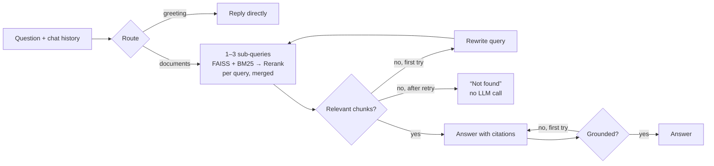

# 📄 PDF Talker

Chat with your PDFs using an **agentic RAG pipeline built with LangGraph**. Upload one or more PDFs and ask questions in plain language. Answers cite the exact file and page, follow-up questions keep their context, and every answer is checked against its sources before you see it.


Deployed on Streamlit Community Cloud. No PDF handy? Click **Try the sample insurance policy** in the sidebar.

---

## ✨ Features

- 🧠 **Agentic RAG (LangGraph)**: routes each message, rewrites follow-ups into standalone queries, splits questions that depend on several facts into sub-queries, grades retrieved chunks, searches again with new wording when nothing is relevant, and runs a grounding check that triggers a stricter regeneration if a claim isn't supported
- 🔀 **Hybrid retrieval**: FAISS semantic search + BM25 keyword search, merged with reciprocal rank fusion, then **Cohere Rerank**
- 📚 **Citations**: every answer cites `[n]` sources with file name, page number and relevance score
- 💬 **Real chat**: conversation memory and streamed answers
- 📂 **Multiple PDFs** per session, with clear messages for scanned or unreadable files
- 🔍 **Under the hood**: a live agent trace, retrieved chunks, latency, time to first token and tokens used
- 📏 **Evaluation harness** comparing three pipeline modes on a labelled question set
- 📡 **LangSmith** tracing

## 🧠 How the agent works



The app also lets you switch to **Hybrid** (no agent steps) or **Basic** (FAISS top-3, the original pipeline), so you can compare the modes side by side.

## 📊 Evaluation

`evaluation.py` runs every mode over [`eval/eval_set.json`](eval/eval_set.json): 18 questions about a 15-page fictional insurance policy ([`eval/sample_policy.pdf`](eval/sample_policy.pdf)). The set includes exact-code lookups, paraphrased questions, a question that needs two sections, and 2 questions the document can't answer.

| Mode | hit@3 | MRR | Correctness | Faithfulness | Avg latency |
|---|---|---|---|---|---|
| **Agentic** (LangGraph) | **0.94** | **0.94** | **94%** | **100%** | 10.9s |
| Hybrid + rerank | 0.94 | 0.94 | 94% | 100% | 3.2s |
| Basic (FAISS top-3) | 0.88 | 0.84 | 89% | 94% | 2.5s |

What the numbers show:
- Hybrid search fixed the cases where pure vector search missed the right page. For example, the cooling-off question: basic retrieval never found page 1 and answered "not found".
- Agentic mode matches hybrid on these single-turn questions. Its extra steps pay off where this set doesn't measure: follow-up questions (rewritten into standalone queries), weak evidence (it broadens the search), and answers that fail the grounding check. It costs about 3× the latency.
- Every mode still misses the question that needs two sections ("burst pipe while away for two months" depends on both the *unoccupied* definition and an exclusion). The agent now finds the exclusion but doesn't yet connect it to the 45-day definition.

- **hit@3 / MRR**: did retrieval return a chunk from the correct page, and how high was it ranked
- **Correctness**: an LLM judge compares the answer with the ground truth. For out-of-scope questions, the answer must decline instead of guessing.
- **Faithfulness**: an LLM judge checks every claim against the retrieved chunks

The judge is the same Cohere model, so treat the numbers as a relative comparison between modes, not an absolute score. Per-question answers and verdicts are in [`eval/results/results.json`](eval/results/results.json).

```bash
python evaluation.py                                   # sample policy, all modes
python evaluation.py --pdf my.pdf --set my_set.json    # your own document and questions
```

## 🗂️ Project structure

```
PDFTalker/
├── app.py                  # Streamlit chat UI (streaming, citations, agent trace)
├── agent.py                # LangGraph graph: routing, rewriting, grading, grounding check
├── rag_pipeline.py         # PDF loading, chunking, FAISS + BM25, fusion, reranking
├── evaluation.py           # Compares the pipeline modes on a labelled set
├── eval/
│   ├── sample_policy.pdf   # Fictional 15-page policy used for the demo and evaluation
│   ├── make_sample_pdf.py  # Regenerates the sample PDF
│   ├── eval_set.json       # Questions, ground truth and expected pages
│   └── results/            # Latest evaluation output
├── tests/                  # Offline unit tests (no API key needed)
├── .streamlit/config.toml
├── requirements.txt        # App dependencies (no torch, small enough for free hosting)
└── requirements-eval.txt   # Dev extras: pytest, reportlab
```

## 🚀 Run locally

```bash
git clone https://github.com/Milankalathiya/PDFTalker.git
cd PDFTalker
python -m venv .venv
.venv\Scripts\activate            # Windows  (macOS/Linux: source .venv/bin/activate)
pip install -r requirements.txt
copy .env.example .env            # then add your COHERE_API_KEY
streamlit run app.py
```

Tests: `pip install -r requirements-eval.txt` then `pytest`.

## 🌐 Deploy (Streamlit Community Cloud)

1. Push to GitHub (`.env` is gitignored).
2. On [share.streamlit.io](https://share.streamlit.io), create an app from the repo with `app.py` as the entry point.
3. Under **Settings → Secrets**, add:
   ```toml
   COHERE_API_KEY = "your_cohere_api_key"
   LANGCHAIN_API_KEY = "your_langsmith_api_key"   # optional
   LANGCHAIN_TRACING_V2 = "true"
   LANGCHAIN_PROJECT = "PDFTalker"
   ```

Embeddings, reranking and generation all run on Cohere's API, so the app installs no torch or local models and fits comfortably within the free tier.

## 🧰 Tech stack

Streamlit · LangGraph · LangChain · Cohere (`command-r-plus-08-2024`, `embed-english-v3.0`, `rerank-v3.5`) · FAISS · BM25 (`rank-bm25`) · pypdf · LangSmith · pytest

## 👤 Author

**Milan Kalathiya**, AI engineer (agentic AI, RAG, Python and Java backends)

- ✉️ [kalthiyamilan@gmail.com](mailto:kalthiyamilan@gmail.com)
- 💼 [linkedin.com/in/milankalathiya](https://linkedin.com/in/milankalathiya)
- 🐙 [github.com/Milankalathiya](https://github.com/Milankalathiya)

Issues and suggestions are welcome.
